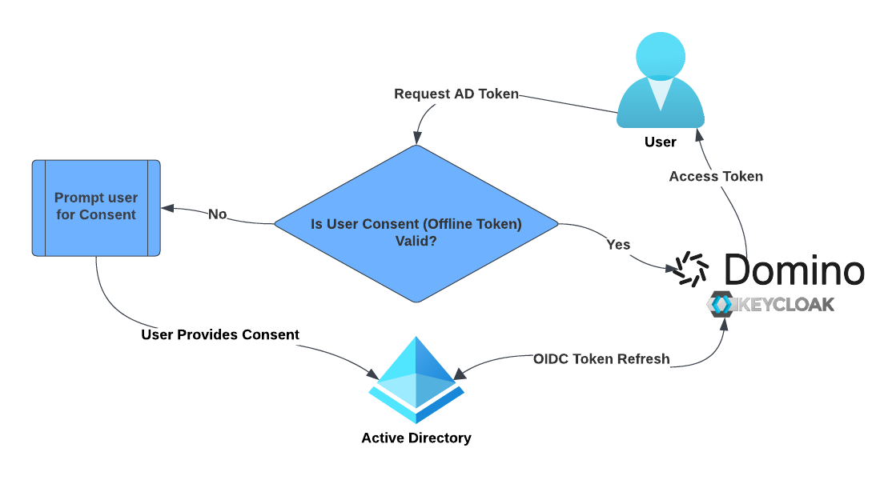

### [AD User Credentials](/azure-ad-user-tokens/README.md)

[Azure AD/Entra ID](https://www.microsoft.com/en-gb/security/business/identity-access/microsoft-entra-id) based authentication allows for end users to request short lived OAuth tokens from Azure, to be used for authentication to downstream services integrated with AD

AD Authentication is an Industry standard method, using the OAuth standard to secure access to sensitive Data. This also allows for user level audits for data access, providing a complete audit trail for sensitive data as well as centrally managed RBAC

**Why should you use AD User Credentials?**

- Your Enterprise Policy forbids the use of long lived credentials (Username/Password, Access Key, SAS/Database token)
- You require strong auditing of all data reads & writes
- You would like to use OAuth standards to propagate short lived credentials to Domino Workloads
- Your Data source access is centrally managed via AD and you want to propogate the same access to Domino

**AD User Credentials work as follows:**

1. Each Domino instance establishes an OIDC trust with an AD Application. This allows Domino to request and manage tokens on the user's behalf

2. We set `API Permissions` on the AD Application to allow access for your target APIs. This could include Azure Databricks, Blob Storage, ADLS Gen 2 etc.

3. When a user first requests a token within a workspace, they are presented with a URL to authenticate. This redirects them to the Azure Application where they have to provide consent for the specific APIs they are accessing

4. Once user consent is provided, AD provides Domino with an Access token as well as an Offline Refresh token. The user is given the Access token in their workspace, allowing them to authenticate to Azure services. The Refresh token is hidden from the user, and Domino refreshes the Access token regularly on the user's behalf

5. The user consent lasts as long as the refresh token does, and this is configurable from your AD Tenant. While consent is active, the Access token is available for all user Workspaces/Jobs/Scheduled jobs without requiring user intervention

6. When the consent/Offline token expires the user is again presented with the Authorisation url to provide consent.

[Demo](azure-ad-user-tokens/assets/UserDemo.mov)

**How do I enable this within my own Instance**

For Domino versions below 5.10, contact your Domino representatives to help enable this feature

For Domino 5.10+, follow our [guide](./azure-ad-user-tokens/README.md) on github

**What about Service Accounts?**

Domino supports [Azure Workload Identity](https://learn.microsoft.com/en-us/azure/aks/workload-identity-overview?tabs=dotnet) for Service Account credentials from Azure AD. Watch this space for a guide coming soon, or contact your Domino representatives to setup a demo.