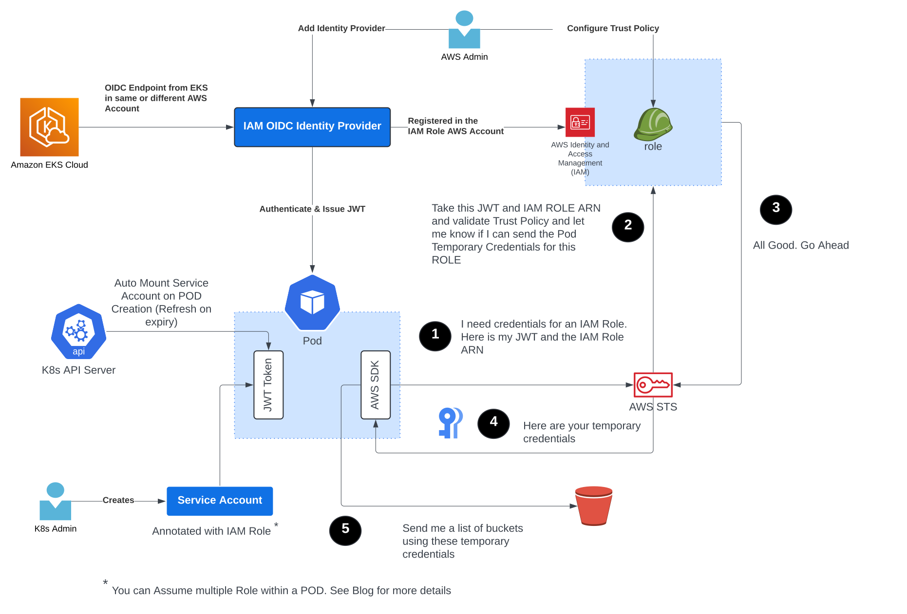

### [IRSA](./advanced-credential-propagation/irsa/README.md)

IAM Role for Service Accounts ([IRSA](https://docs.aws.amazon.com/eks/latest/userguide/iam-roles-for-service-accounts.html)) 
is a capability which allows Kubernetes Service Accounts attached to a EKS workload to assume IAM Role(s). 
This is similar to attaching an IAM Role to an EC2 instance.

**When should you consider using IRSA with Domino?**

- Does your Enterprise Policy forbid the use of long lived credentials?
- Would you like to use OAuth standards to propagate IAM Role to Domino Workloads? 
- Would you would like to propagate an IAM Role to a Domino workload based on *complex and custom criteria*?

**Why does IRSA with Domino help achieve the above goals?**

When using the IRSA support in Domino, any Domino hosted workloads can assume IAM roles 
in any AWS account configured to trust the Domino Platform.

More specifically, Domino workloads running on on-premise dataplanes as well as dataplanes in GKE and AKS can assume 
IAM roles in any AWS Account which has established trust with the OIDC provider associated with the Domino dataplane.

This enables use-cases like running data engineering workloads in EKS dataplane, store training datasets in S3 and 
download them on an on-premise Domino Training Job running on an on-premise GPU HW Tier without having to store long 
lived credentials in the on-premise dataplane.

**How does IRSA work with Domino?**

1. Each EKS Cluster has a unique OIDC provider associated with it. This provider is configured as an IAM identity provider
   within ***an AWS Account*** the EKS workloads want to assume an IAM Role. They key point here is
   that the EKS cluster and the IAM Role being assumed by a workload running on EKS do not need to be in the 
   same AWS Account.

2. For a Pod to be able to assume an IAM Role, it must use the `STS:AssumeRoleWithWebIdentity` API
   which returns temporary security credentials. But first the caller (in this case pod) needs to authenticated with a
   Web Identity Provider that is compatible with the OpenID connect (OIDC) protocol.
   
3. EKS provides an OIDC provider and binds it the KubeAPIServer. And starting [1.12](https://kubernetes.io/docs/concepts/storage/projected-volumes/) 
   Kubernetes allows an OIDC provider to be bound to it. A JWT created by this OIDC provider can be mounted as a 
   projected volume in the Pod.
   
4. This Service Account token acts as a workload identity credential that can be validated by AWS STS in order to pass 
   IAM role credentials to that workload.

5. An AWS Admin will configure the IAM Role Trust Policy to enable a specific Service Account Token 
   (As identified by the JWT above) to assume the Role.  AWS STS  will validate the workload identity and 
   return temporary IAM Role Credentials to a workload if a IAM Role Trust Policy allows it.
   
6. Typically the `amazon-eks-pod-identity-webhook` will apply mutations based on annotations defined on the Service 
   Account of the pod. Domino provides its own mutating webhook `domsed` to enable a user to switch roles which does
   not rely on Service Account annotations. But more importantly this allows workloads running in Domino data planes 
   running on-premise or in other cloud providers like GCP and Azure to assume AWS IAM Roles

