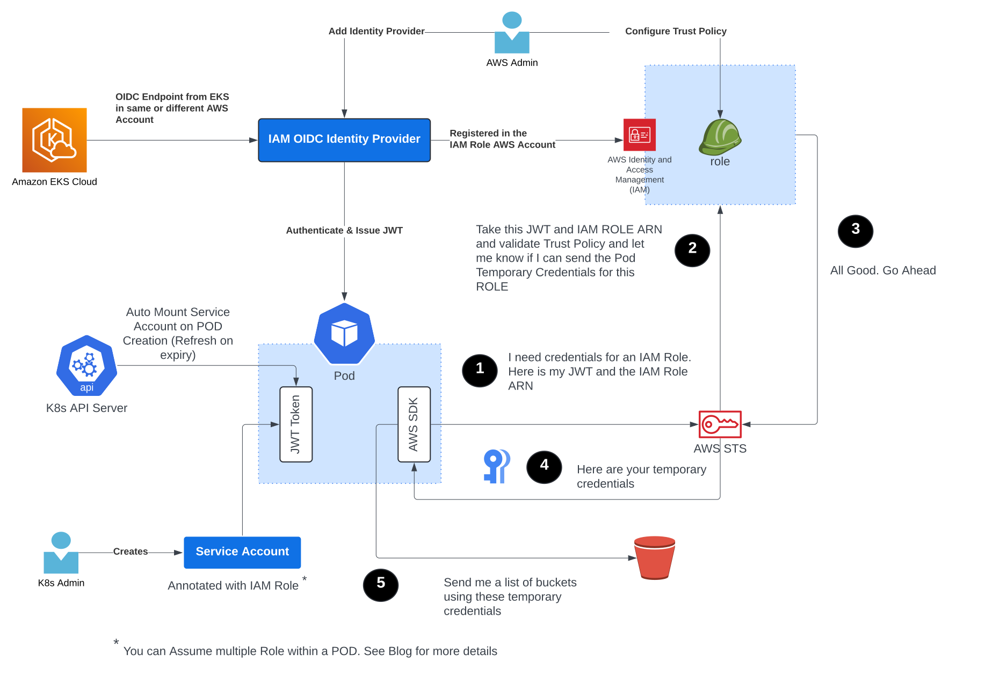

# Examples

## Advanced Credential Propagation

Methods described below extend Domino's Capability to seamlessly achieve Credential Propagation using the methods supported
by the underlying Identity Provider that the Domino workload authenticate with. Speak to your Domino CSM for more 
details.

### IRSA

IAM Role for Service Accounts ([IRSA](https://docs.aws.amazon.com/eks/latest/userguide/iam-roles-for-service-accounts.html)) is a capability which allows Kubernetes Service Accounts attached to a EKS workload to assume IAM Role(s). In much the same way as you can attach and IAM Role to an EC2 instance at startup.

The IRSA Capability follows the steps below:

1. Each EKS Cluster has a unique OIDC endpoint associated with it. This endpoint is configured as an IAM identity provider
   within an AWS Account the EKS workloads want to assume an IAM Role.

2. An OIDC JWT token is projected into the mounted volumes for any workload that uses any Kubernetes Service Account 
   ([Native K8s Capability](https://kubernetes.io/docs/concepts/storage/projected-volumes/))

3. This Service Account token acts as a workload identity credential that can be validated by AWS STS in order to pass 
   IAM role credentials to that workload.

4. An AWS Admin will configure the IAM Role Trust Policy to enable a specific Service Account Token 
   (As identified by the JWT above) to assume the Role.  AWS STS  will validate the workload identity and 
   return temporary IAM Role Credentials to a workload if a IAM Role Trust Policy allows it.

