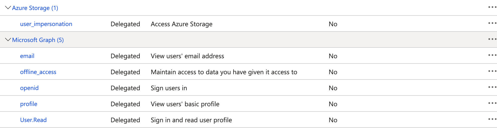

# Azure AD User Credentials 


## Enterprise Application

To delegate identity and access management functions to Microsoft Entra ID, an application must be registered with a Microsoft Entra tenant. When you register your application with Microsoft Entra ID, you're creating an identity configuration for your application that allows it to integrate with Microsoft Entra ID

The steps to create the Azure Application fall outside the scope of this document, but there are pointers for how to configure it below. You can reuse an existing application that is already configured for SSO with Domino.

## Keycloak Setup

- We will need to create a new IDP in keycloak using the OIDC protocol. This step is required even if the application is already configured for SSO with an existing IDP
  
- Go to Azure UI Entra ID → Application → Overview → Endpoints → OpenID Connect metadata documents → Copy

  

- Go to Domino Keycloak UI → New OIDC provider → import External IDP Config → Paste & Import the config

  

- Now that the OIDC provider imported the application config, you need to fill in: 
    - `Client ID` with the Application `Client ID`
    - `Client secret` with the Application Secret
    - Configuration `Store Tokens` and `Stored Tokens Readable` need to be enabled
    - First Login Flow should be `Domino First Broker Login`
    - `Account Linking Only` should be `On`
    - `Disable user info` should be `On`

  

- Under the `Mappers` section, add a new `Attribute Importer` type mapper , setting `Claim` and `User Attribute Name` to `email`
  
  

- Back in the Azure application, add the `Redirect URI` from keycloak back in the Azure application (Under the `Authentication` section)

- In the Azure Application, under API permissions, add permissions for the target Azure resource you want to connect to (this example will use storage)
  

- Finally, in your Keycloak IDP, under the `Default Scopes` section, add `offline_access https://storage.azure.com/user_impersonation` - The second scope should match your target API from the step above, we are using storage as an example here

## Token exchange setup

Follow the [Keycloak Documentation](https://www.keycloak.org/docs/latest/securing_apps/#internal-token-to-external-token-exchange) to set up the permissions for Internal-External token exchange between the domino-play client in Keycloak and your newly created IDP, in section 7.3.1

For step 4 from the documentation, `Client Policy Creation`, use `domino-play` as your client for the policy

## Install dependencies & Test

We use a simple python library `domino_aad` to perform the exchange on the user's behalf, and return a `TokenCredential` object that can be used by the azure python SDK.

- `pip install https://mirrors.domino.tech/domino_aad-0.0.4-py3-none-any.whl` in your workspace/compute environment

- The code example below uses storage again, please adjust to test other services. You will have to configure `account_url` to point to a storage account to test against, as well as `creds` to the name of the new IDP created in the previous steps

```
from domino_aad import DominoCredential
from azure.storage.blob import BlobServiceClient

account_url = f'https://xxxx.blob.core.windows.net'

# 'azstorage' is as per the Keycloak configuration for the local environment
# Input will be different for different APIs (blobs, datalake, mysql etc)
creds = DominoCredential("azstorage")

blob_service_client = BlobServiceClient(account_url, credential=creds)

[print(container) for container in blob_service_client.list_containers(include_metadata=True)]
```

- The first time you run this, the API will return a URL instead of a token. Click this URL, which will redirect you to Azure for allowing access. Once the access is granted, you can come back to the workspace and just hit Enter to continue

[Demo](azure-ad-user-tokens/assets/UserDemo.mov)